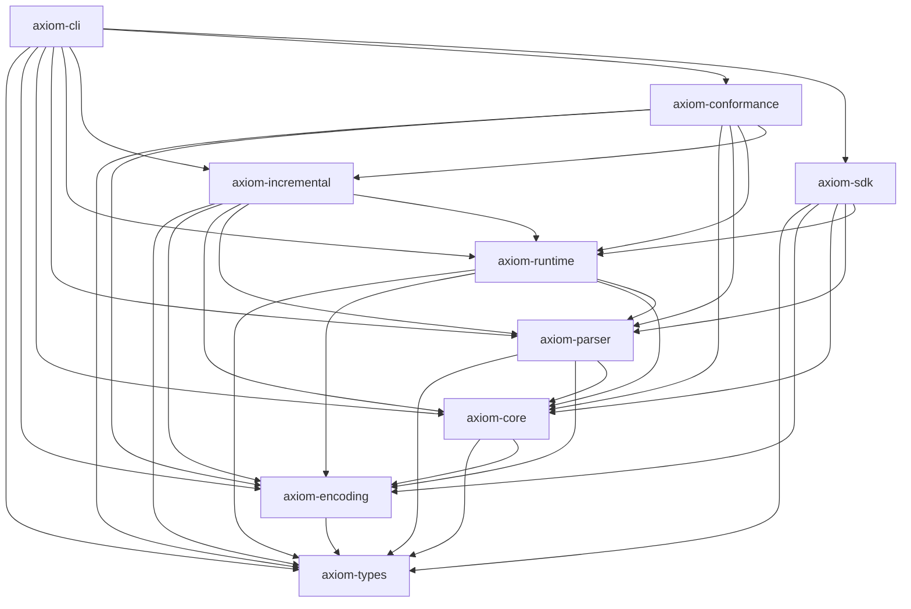

# Axiom IR — Architecture

Axiom IR is a universal, proof-carrying intermediate representation and deterministic
runtime for machine reasoning. This document describes the crate layout, the layered
architecture, the trusted computing base, and how the textual language, canonical
encoding, and runtime fit together. All claims here are verified against the source in
`crates/`; the normative semantics live in `spec/semantics.md` and are authoritative
where they conflict with prose.

## Crate layout and responsibilities

| Crate | Responsibility | Key types / entry points |
|---|---|---|
| `axiom-types` | Typed value model: exact arithmetic, units, typed uncertainty. No I/O, no hashing. | `Num`, `Quantity`, `Unit`, `Uncertainty`, `Type`, `Value`, `Relation` |
| `axiom-encoding` | Canonical JSON + domain-separated content addressing (SHA-256). | `Id`, `Domain`, `canonical_bytes`, `content_id`, `hash_domain`, `hash_concat` |
| `axiom-core` | Trusted semantic core: first-class objects, the transition calculus, and the verification invariant. No I/O. | `Module`, `Claim`, `Evidence`, `Assumption`, `Context`, `Derivation`, `Obligation`, `Contradiction`, `Receipt`, `Event`, `ClaimStatus`, `OperationDef`, `BuiltinExecutor`, `OpExecutor`, `OpRegistry` |
| `axiom-parser` | Line-oriented textual language: lexer, recursive-descent parser, canonical formatter, diagnostics. Syntactic only. | `ModuleAst`, `Stmt`, `Expr`, `TypeExpr`, `UncertaintyExpr`, `Span`, `Diagnostic`, `parse_module`, `format_source` |
| `axiom-runtime` | Deterministic executor over the core, external receipts, replay, contradiction detection, structural explanation. | `Runtime`, `run_source`, `explain`, `contradictions`, `detect_contradictions`, `replay_mode`, `grant`, `with_builtin_tool`, `ExternalExecutor`, `ReplayOnlyExecutor`, `ToolCalculator` |
| `axiom-incremental` | Dependency graph and incremental invalidation engine. | `DependencyGraph`, `InvalidationReport`, `StatusChange`, `invalidate_and_recompute`, `full_recompute` |
| `axiom-sdk` | Ergonomic Rust facade (`Builder`) re-exporting core vocabulary. | `Builder`, re-exports of `Module`, `Runtime`, `Num`, `Quantity`, `Uncertainty`, … |
| `axiom-cli` | The `axiom` binary. | subcommands in `commands`; `main` (`clap`) |
| `axiom-conformance` | Fixture runner (`valid/` + `invalid/` with `.expect.json`). | `run`, `ConformanceReport`, `Expectation` |

## Layering

The dependency edges below are exactly those declared in each crate's `Cargo.toml`
(confirmed by reading them; the workspace is defined in the root `Cargo.toml`, which this
document does not modify).



The layering is a strict stack:

- **`types` → `encoding` → `core`** form the foundation. `core` depends only on `types`
  and `encoding`; it never depends on the parser, runtime, or any async/I/O crate.
- **`parser`** depends on `types`, `encoding`, and `core`. It is *syntactic*: it resolves
  no label references and performs no type checking. `parse_module` produces a `ModuleAst`;
  `format_source` renders canonical text (idempotent: `format(format(ast)) == format(ast)`).
- **`runtime`** depends on `parser` plus the foundation. It performs semantic analysis
  (label resolution, type checking), executes the module against the core, and manages
  external receipts and capabilities.
- **`incremental`** sits above `runtime`: it operates on a `Module` (and reuses
  `BuiltinExecutor`) to invalidate and recompute.
- **`sdk`** is a thin facade over `runtime`/`core`/`parser`/`encoding`/`types`.
- **`cli`** and **`conformance`** are the top applications; both depend on `incremental`
  (the CLI also bundles `conformance` and `sdk`).

## Trusted computing base (TCB)

The TCB is the set of crates that, if correct, guarantee the deterministic,
auditable semantics: **`axiom-types` + `axiom-encoding` + `axiom-core`**.

- None of these crates performs I/O, network access, or filesystem access.
- `axiom-core::Module` is a pure state machine: `assert`, `assume`, `derive`, `verify`,
  `contradict`, `invalidate`, `attest`, … take and return data; external operations are
  supplied to `Module::derive` as either a `Receipt` or an `OpExecutor` callback, so the
  core never *invokes* an external side effect.
- `axiom-core` enforces the central invariant `INV-VERIFY` in `Module::verify` and
  re-checks it after execution through `Module::check_verification_invariant`. No path can
  set `status = Verified` without a complete derivation and every mandatory obligation in
  state `Satisfied`/`Waived`; external derivations additionally require an
  integrity-checked receipt.

Everything above the TCB (parser, runtime, incremental, CLI, SDK) is "glue": it turns
text or Rust builder calls into core transitions and re-checks the invariant. A bug
there can refuse valid input or produce a confusing error, but it cannot silently violate
`INV-VERIFY`, because the core gate runs independently.

## How the textual language, canonical encoding, and runtime fit together

1. **Authoring.** A module is written in the line-oriented textual language
   (`module demo "1"` header, then one instruction per line: `assert`, `observe`,
   `assume`, `derive`, `require`, `discharge`, `verify`, `challenge`, `contradict`,
   `branch`, `merge`, `invalidate`, `attest`, `call`, `evidence`). Derived claims may carry
   a trailing `ctx <context>` clause; external calls use `cap "<capability>"` and an
   optional `ctx`.
2. **Parsing.** `axiom-parser::parse_module` lexes and parses into a `ModuleAst`. Because
   the parser is syntactic, label references (e.g. `derive sum = add(a, b)`) are left as
   bare strings; resolution happens later. Malformed input yields `Diagnostic`s with byte
   `Span`s.
3. **Canonical text.** `format_source` produces the canonical form (`axiom fmt`). The
   formatter is deterministic and idempotent, which makes textual modules
   diff-able and stable under version control.
4. **Execution.** `axiom-runtime::Runtime::execute` walks the `ModuleAst`, resolves labels
   against a label→`Id` map, type-checks via `Value::check`, and applies core transitions.
   Evidence and assertions bind first (evidence has no dependencies); dependency-bearing
   statements (derivations, calls, verify, contradict, …) execute in dependency order via a
   worklist, so forward references are legal and declaration order is semantically
   irrelevant.
5. **Content addressing.** Every node is addressed by an `Id` =
   `<domain>.1.<hex64>`. `Id` hashes `domain_tag || 0x00 || canonical_bytes` with SHA-256
   (`hash_domain`), so a claim id can never collide with an evidence id of identical
   content. `canonical_bytes` recursively sorts object keys and emits no insignificant
   whitespace. This is what makes the module digest (`Module::digest`) deterministic and
   what lets replay reconstruct identical state.
6. **Verification gate.** After execution the runtime calls
   `Module::check_verification_invariant`; the CLI then reports which claims verified and
   which derived-but-not-verified claims are blocked by `INV-VERIFY`.

## Module state model

A module is the labelled, addressable tuple from `spec/semantics.md`:

```
M = (C, E, A, X, D, O, P, R)
```

| Component | Meaning | Field on `Module` |
|---|---|---|
| `C` | claims | `Module.claims: IndexMap<Id, Claim>` |
| `E` | evidence | `Module.evidence` |
| `A` | assumptions | `Module.assumptions` |
| `X` | contexts | `Module.contexts` |
| `D` | derivations | `Module.derivations` |
| `O` | proof obligations | `Module.obligations` |
| `P` | contradiction witnesses | `Module.contradictions` |
| `R` | external receipts | `Module.receipts` |

Side structures: `operations` (`IndexMap<Id, OperationDef>`, the registered operation
definitions), `events` (the deterministic event log, a `Vec<Event>`), and a distinguished
`root_context` id (`X_root`). `Module` is created with `Module::new`, which installs the
root context and sets `format_version = "1"` and `runtime_version` from the crate version.

### Claims

A `Claim` carries `id` (**node identity**, content-addressed over `(label, context_id)` —
stable across recomputation and *independent of value*), `semantic_id` (**semantic
identity**, a content hash over `(ty, value)` only — two claims with the same proposition
share it), `label`, `span`, `ty`, `value`, `status`, `uncertainty`, `context_id`,
`assumptions`, `evidence`, `derivation`, `obligations`, `invalidation_conditions`, and
`provenance`. `Claim::depends_on(m)` returns the union of its assumptions, evidence, and
(through its `Derivation`) inputs — this is the edge set used by the incremental engine.

`ClaimStatus` is one of `Asserted`, `Assumed`, `Observed`, `Pending`, `Disputed`,
`Challenged`, `Verified`, `Invalidated`, `ExternallyAttested`. The `Verified` state is
only reachable through `Module::verify`, which enforces `INV-VERIFY`.

### Evidence, assumptions, contexts

- `Evidence` carries `content_hash`, `media_type`, `provenance`, acquisition metadata,
  `trust` (`Trusted`/`Untrusted`/`Unverified`), and optional `signature`/`content`. Axiom
  distinguishes **evidence existence** from **evidence relevance**: attaching evidence to a
  claim records a dependency; it does not discharge an obligation and does not make the
  claim verified.
- `Assumption` introduces exactly one claim (`claim`) and is `challengeable`/`removable`.
  Removing or contradicting an assumption invalidates every verified claim whose
  dependency chain reaches it, and only those.
- `Context` is a persistent reasoning environment with `parent`, `label`, `assumptions`,
  `inherited_claims`, `local_claims`, `contradictions`, and `merge_of`. Contexts form a
  tree; a claim is local to the context that created it and inherited into children. A
  claim may be verified in one context and contradicted in another — contexts do not
  corrupt one another.

### Derivations, obligations, contradictions, receipts

- `Derivation` records `op`, `op_version`, `inputs`, `output`, `output_label`,
  `generated_obligations`, `receipt`, `provenance`, `runtime_version`. `output_label` is
  retained so incremental recomputation reproduces the exact same node identity.
- `Obligation` is first-class: `kind`, `target`, `inputs`, `severity` (`Mandatory`/
  `Advisory`), `state` (`Pending`/`Satisfied`/`Failed`/`Waived`/`Unsupported`),
  `discharged_by`, `message`. A mandatory obligation that is not `Satisfied`/`Waived`
  blocks `verify`.
- `Contradiction` is a witness (`kind`, `claims`, `context`, `witness`, `evidence`); it
  MUST NOT erase either branch.
- `Receipt` is an immutable record of an external call outcome (see
  `docs/deterministic-replay.md`).

## The event log

Every state transition appends an `Event` to `Module::events`:

```
Assert { claim, status }      Observe { claim }            Assume { assumption, claim }
Derive { derivation, output, op }                          Require { obligation, target }
Discharge { obligation, by, state }                        Verify { claim }
Challenge { claim }            Contradict { contradiction } Branch { context, parent }
Merge { context, a, b, conflicts }                         Invalidate { claim, reason }
Attest { claim }
```

The event log is the deterministic record of *how* a module reached its current state.
`Module::event_log_digest()` canonicalizes the `Vec<Event>` and content-addresses it in
the `Event` domain, so two runs that apply the same transitions in the same order produce
the same event-log digest. Because execution is order-independent in *input* terms but the
runtime still commits events in execution order, the event log is part of what the
determinism theorem (see `docs/deterministic-replay.md`) guarantees is reproducible.

## Determinism and the invariant at a glance

The normative numeric path is **exact**: `Num` is `Int(i128)` / reduced `Rational` /
fixed-scale `Decimal` (`scale <= 38`); IEEE-754 floats are never used in the normative
path. `Module::digest` sorts node ids before canonicalizing, so the digest is independent
of insertion order. With identical canonical input, operation versions, capabilities,
evidence, receipts, and runtime version, execution produces identical claim/derivation/
obligation/event/digest — the property the conformance suite and `axiom verify` assert.

## Where to go next

- Deterministic execution and offline replay: `docs/deterministic-replay.md`
- The invalidation frontier and incremental recomputation: `docs/incremental-invalidation.md`
- Explanations as derived graph structure: `docs/explanation-model.md`
- Normative semantics (authoritative): `spec/semantics.md`
