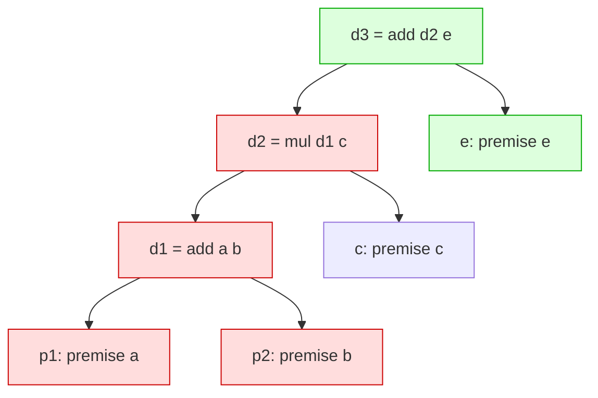

# Incremental Invalidation

When a premise, assumption, evidence, receipt, or operation version changes, Axiom does not
re-derive everything. It computes the exact set of claims that transitively depend on the
changed node — the **invalidation frontier** — invalidates them, and recomputes only the
eligible derivations whose inputs are still available. Unrelated verified work is
preserved untouched. This document explains the graph, the algorithm, the
`InvalidationReport`, and how to read the `axiom invalidate` output.

## The dependency graph

`axiom_incremental::DependencyGraph::build(m)` walks every claim and calls
`Claim::depends_on(m)`, which returns the claim's assumptions, evidence, and (through its
`Derivation`) input claims. It stores two maps:

- `forward: HashMap<Id, Vec<Id>>` — who a claim depends on.
- `reverse: HashMap<Id, Vec<Id>>` — who depends on a claim (the reverse edges).

`dependents(node)` returns the direct reverse edges; `transitive_dependents(node)` performs
a BFS over `reverse` to compute the full invalidation frontier. This is the reverse
dependency index that `invalidate_and_recompute` seeds from.



In the graph above, if `a` (or `b`) changes, the frontier is `{d1, d2, d3}`
(highlighted): `d1` depends directly on `a`/`b`; `d2` depends on `d1`; `d3` depends on
`d2`. `c` and `e` are premises/inputs that *feed* the frontier but are not themselves
derived from `a`, so they are not invalidated. By construction the frontier contains
exactly the transitive dependents and nothing else (INV-MINIMALITY).

## The invalidation frontier and why a premise change keeps the premise valid

`invalidate_and_recompute(m, changed, executor)` proceeds as:

1. **Seed the affected set** from `changed` via `reverse_dependents` (BFS over `reverse`).
   If `changed` itself is a claim, it is included as a seed.
2. **Keep the changed premise valid.** If `changed` is a *premise* — a claim with no
   `derivation` (an asserted/observed/assumed node) — it is **removed from `affected`**. A
   premise whose value changed is the corrected input; it stays valid, and removing it also
   lets its dependents be recomputed (their input is now available). Only the derived
   dependents are invalidated.
3. **Invalidate.** Every claim still in `affected` is set to `Invalidated`, its
   `invalidation_conditions` records `"dependency <changed> changed"`, an `Invalidate`
   event is emitted, and a `StatusChange` is recorded. If a claim was already
   `Invalidated`, it is left as-is (no duplicate change).
4. **Topological recomputation.** Derived claims in `affected` whose inputs are all
   available (`!affected || recomputed`) and not themselves `Invalidated` are recomputed
   via `Module::derive` and then `Module::verify`. This is a worklist loop to a fixpoint: a
   claim becomes recomputable only after its invalidated inputs have been recomputed.
   Recomputed claims re-enter `Pending`→`Verified` (where obligations allow), and a second
   `StatusChange` records the recovery.
5. **Preserve.** Verified claims outside `affected` are collected into `preserved`
   untouched — their status is never mutated.

## Preservation of unrelated verified work

The engine invalidates exactly `frontier(changed)` and no claim outside it
(INV-MINIMALITY, `spec/semantics.md` §5–§6.4). Removing an unrelated premise MUST NOT
invalidate independent conclusions. The `preserved` list makes this explicit and auditable:
it is every claim whose `status == Verified` and whose id is not in `affected`.

## The InvalidationReport

`InvalidationReport` is the machine-readable explanation of an invalidation pass:

```rust
pub struct InvalidationReport {
    pub roots: Vec<Id>,          // the node(s) whose change triggered invalidation
    pub invalidated: Vec<Id>,    // claims marked Invalidated and not recomputed
    pub recomputed: Vec<Id>,     // claims successfully recomputed
    pub preserved: Vec<Id>,      // verified claims left untouched
    pub changes: Vec<StatusChange>, // every status transition, in order
}

pub struct StatusChange {
    pub claim: Id,
    pub label: String,
    pub from: ClaimStatus,
    pub to: ClaimStatus,
    pub reason: String,
}
```

The CLI exposes this via `axiom invalidate <module> <node>`, which resolves `<node>` to an
`Id` through `Runtime::claim` and calls `invalidate_and_recompute(&mut rt.module, &id,
&BuiltinExecutor)`.

Human output:

```text
invalidation frontier rooted at 'a' (claim.1.<hex64>)
  invalidated: derivation.1.<...>, derivation.1.<...>
  recomputed:  derivation.1.<...>
  preserved:   2 verified claims untouched
  status changes:
    d1: verified -> invalidated (transitive dependency on claim.1.<...> changed)
    d1: invalidated -> verified (recomputed from available inputs)
```

JSON output (`--json`):

```json
{
  "root": "a",
  "invalidated": ["derivation.1.<...>", "..."],
  "recomputed": ["derivation.1.<...>"],
  "preserved_count": 2,
  "changes": [
    { "label": "d1", "from": "verified", "to": "invalidated",
      "reason": "transitive dependency on claim.1.<...> changed" },
    { "label": "d1", "from": "invalidated", "to": "verified",
      "reason": "recomputed from available inputs" }
  ]
}
```

How to read it:

- **`invalidated`** — claims that depended on the changed node and could not be
  recomputed (e.g. because an input is still `Invalidated`, or the derivation itself is the
  root). These are the losses.
- **`recomputed`** — claims that were invalidated and then successfully re-derived and
  re-verified from available inputs. A change entry `invalidated -> verified` per
  recomputed claim shows recovery.
- **`preserved_count`** (and, in the human text, `preserved: N verified claims untouched`)
  — the count of verified claims outside the frontier. This is the proof of
  INV-MINIMALITY for this run.
- **`changes`** — the full ordered list of `StatusChange`s; each has `from`/`to` status and
  a `reason` string. Reading the `changes` array top-to-bottom reproduces the exact status
  evolution of the module during the pass.

## Contrast with full_recompute

`axiom_incremental::full_recompute(m, executor)` re-executes **every** derivation from
scratch, in insertion order, preserving each derivation's original context so node
identities stay stable. It returns the number of derivations re-run. It is provided as a
benchmark baseline: the incremental engine should produce a semantically equivalent result
while touching only the frontier.

| | `invalidate_and_recompute` | `full_recompute` |
|---|---|---|
| Scope | only `frontier(changed)` | all derivations |
| Untouched verified work | explicitly preserved (`preserved`) | implicitly overwritten/re-derived |
| Output | `InvalidationReport` (roots, invalidated, recomputed, preserved, changes) | count of re-run derivations |
| Use | incremental update after an edit | correctness baseline / benchmark |

The conformance suite pins expected `invalidated` and `preserved` label sets per fixture
(`Expectation.invalidation`), so the frontier is checked, not merely assumed.

## Relationship to other docs

- Determinism and receipts: `docs/deterministic-replay.md`
- The `Claim::depends_on` edge set and the module state model: `docs/architecture.md`
- Normative semantics: `spec/semantics.md` §5 (Incremental invalidation), §6.3–§6.4
